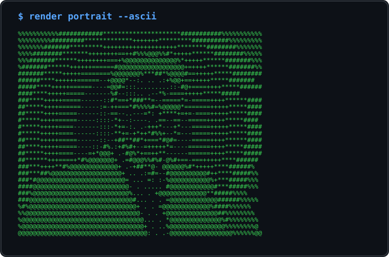
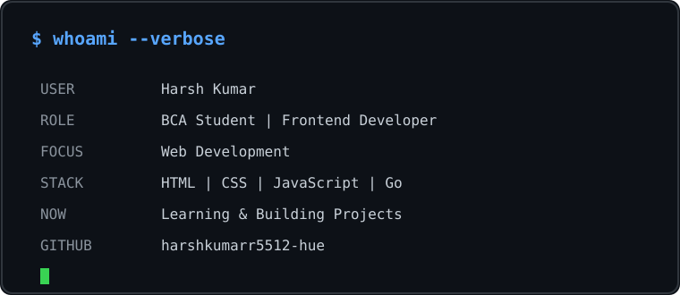

<h1 align="center">
  Hi 👋, I'm Harsh Kumar
</h1>

<p align="center">
  
</p>


<div align="center">


<h2>👋 Hi, I'm Harsh Kumar</h2>

<b>BCA Student • Frontend Developer • Aspiring Software Engineer</b>

<br><br>

<div align="center">
  
</div>

<br>


<br>


<br><br>

[](https://github.com/harshkumarr5512-hue)

</div>

---

# 👨‍💻 About Me

I'm **Harsh Kumar**, a BCA student and aspiring software developer with a strong interest in **Frontend Web Development and Software Engineering**.

I enjoy transforming ideas into clean, responsive and interactive web experiences.

My current development journey focuses on **HTML, CSS, JavaScript, C, Java, Go, SQL and modern web technologies**.

I believe in learning through **real projects, internships and continuous hands-on development**.

### 🎯 Open To

- Frontend Development Internships
- Software Development Opportunities
- Web Development Projects
- Open Source Collaboration
- Full Stack Development Learning
- Technical Project Collaboration

---

# 🛠️ Tech Stack

<div align="center">

### Languages


<br><br>

### Frontend Development


<br><br>

### Database


<br><br>

### Tools & Platforms


</div>

---

# 📊 Development Expertise

| Domain | Level | Technologies / Focus |
|---|---|---|
| 🌐 Frontend Development | Developing | HTML, CSS, JavaScript, Responsive UI |
| 💻 Programming | Developing | C, Java, Go |
| 🗄️ Database | Developing | SQL, DBMS Fundamentals |
| 🔧 Version Control | Developing | Git, GitHub |
| ⚙️ Software Development | Learning | Project-Based Development |
| 🚀 Full Stack Development | Learning | Frontend + Backend Fundamentals |

---

# 🚀 Projects & Core Focus

## 🧪 Featured Projects

<details open>
<summary><b>🖼️ Image Gallery</b></summary>

<br>

An interactive **Image Gallery Web Application** developed as part of a frontend development internship project.

| Category | Details |
|---|---|
| Tech Stack | HTML, CSS, JavaScript |
| Domain | Frontend Development |
| UI | Responsive Web Interface |
| Functionality | Interactive Image Gallery |
| Development | JavaScript-Based Interaction |
| Repository | [View Repository](https://github.com/harshkumarr5512-hue/Image-Gallery) |

### Key Learning

- HTML page structure
- CSS styling
- Responsive web design
- JavaScript interaction
- Git & GitHub workflow

</details>

<br>

<details>
<summary><b>☕ Bean Bliss Coffee Website</b></summary>

<br>

A modern and responsive coffee shop website designed to provide an engaging web experience.

| Category | Details |
|---|---|
| Tech Stack | HTML, CSS, JavaScript |
| Domain | Frontend Development |
| UI | Responsive Design |
| Features | Dark Mode, Navigation, Animations |
| Components | Home, Menu, Reviews, Contact, Footer |

### Features

- Responsive Navigation
- Dark Mode
- Sticky Header
- Menu Section
- Reviews Section
- Contact Section
- Interactive Animations

</details>

---

# 💼 Internship Experience & Selections

> Current internships and officially documented internship selections/offers.

<details open>
<summary><b>💼 Prashant Kumar LTD — Business Development Intern</b></summary>

<br>

**Start Date:** 21 July 2026  
**Duration:** 3 Months

### Focus

- Business development processes
- Job-related drafting activities
- Company and market research
- Reviewing business information
- Professional communication
- Assigned task completion

`Business Development` `Research` `Communication`

</details>

<br>

<details>
<summary><b>💻 CodeAlpha — Frontend Development Intern</b></summary>

<br>

**Duration:** 1 August 2026 – 30 August 2026

Selected for the **Frontend Development Internship**.

### Focus

- Frontend Development
- Hands-on learning
- Assigned development work
- Practical application of technical concepts

`HTML` `CSS` `JavaScript` `Frontend Development`

</details>

<br>

<details>
<summary><b>🌐 CodSoft — Web Development Virtual Internship</b></summary>

<br>

**Duration:** 1 August 2026 – 31 August 2026  
**Mode:** Virtual

Selected for a **1-month Web Development Virtual Internship**.

### Focus

- Web Development
- Practical development tasks
- Project-based learning
- Hands-on technical development

`Web Development` `Frontend` `Projects`

</details>

<br>

<details>
<summary><b>🎨 Oasis Infobyte — Web Development & Designing Intern</b></summary>

<br>

**Offer Date:** 5 August 2026  
**Duration:** 1 Month

Selected for the **Web Development and Designing Internship**.

### Focus

- Web Development
- Web Designing
- Hands-on Development
- Practical Learning

`Web Development` `Web Design` `Frontend`

</details>

<br>

<details>
<summary><b>💡 Prodigy InfoTech — Web Development Intern</b></summary>

<br>

**Duration:** 1 August 2026 – 31 August 2026

Selected for a **1-month Web Development Internship**.

### Focus

- Real-world projects
- Practical development skills
- Web development
- Technical learning

`Web Development` `Projects` `Frontend Development`

</details>

<br>

<details>
<summary><b>✨ InternSpark — Frontend Developer Intern</b></summary>

<br>

**Start Date:** 4 August 2026  
**Duration:** 1 Month

Selected as a **Frontend Developer Intern**.

### Focus

- Task-based learning
- Real-world frontend projects
- Hands-on assignments
- Technical competency
- Problem solving

`Frontend Development` `Projects` `Problem Solving`

</details>

<br>

<details>
<summary><b>🤖 InAmigos Foundation — AI Web Development Internship</b></summary>

<br>

Selected for an **AI Web Development Internship at InAmigos Foundation through Internshala**.

**Selection Date:** 3 June 2026

`AI` `Web Development` `Technology`

</details>

---

# 🎓 Certifications

<details open>
<summary><b>🤖 Introduction to Artificial Intelligence</b></summary>

<br>

**Date:** 21 July 2026  
**Certificate Code:** `10496845`

[📜 View Certificate](ai.pdf)

</details>

<br>

<details>
<summary><b>🧠 GEN AI NASSCOM</b></summary>

<br>

**Date:** 25 July 2026

[📜 View Certificate](ai%20gov.png)

</details>

<br>

<details>
<summary><b>🔐 Tata Cybersecurity Analyst Job Simulation</b></summary>

<br>

**Tata × Forage**  
**Date:** 6 July 2026

### Practical Tasks

- Identity and Access Management Fundamentals
- IAM Strategy Assessment
- Crafting Custom IAM Solutions
- Platform Integration

[📜 View Certificate](Cyber%20Security.pdf)

</details>

<br>

<details>
<summary><b>📊 Exploratory Data Analysis</b></summary>

<br>

**FutureSkills Prime / NASSCOM**  
**Date:** 25 July 2026

[📜 View Certificate](Data%20analysis.pdf)

</details>

<br>

<details>
<summary><b>📈 Deloitte Data Analytics Job Simulation</b></summary>

<br>

**Deloitte × Forage**  
**Date:** 18 June 2026

### Practical Tasks

- Data Analysis
- Forensic Technology

[📜 View Certificate](Deloitte.pdf)

</details>

<br>

<details>
<summary><b>✨ Gemini in Google Meet</b></summary>

<br>

**Date:** 24 July 2026  
**Certificate Code:** `10507834`

[📜 View Certificate](Gemini.pdf)

</details>

<br>

<details>
<summary><b>🌐 Web Development for Beginners</b></summary>

<br>

**Date:** 23 July 2026  
**Certificate Code:** `10503218`

[📜 View Certificate](Web%20Development.pdf)

</details>

---
# 🏆 Achievements & Learning

<div align="center">

| Area | Highlight |
|---|---|
| 💻 Frontend Development | Built practical frontend web projects |
| 💼 Internship Exposure | Selected across Web Development, Frontend and Business Development programs |
| 🎓 Technical Learning | Learning across AI, Data Analytics, Cybersecurity and Web Development |
| 🔧 Version Control | Managing and publishing projects using Git & GitHub |
| 🚀 Project Development | Building practical projects through hands-on learning |

</div>

---

# 💻 Coding Profile

<div align="center">

[](https://github.com/harshkumarr5512-hue)

</div>

---

# 📊 GitHub Analytics

<div align="center">


<br><br>


</div>

---

# 🏆 GitHub Trophies

<div align="center">


</div>

---

# 📈 Contribution Activity

<div align="center">


</div>

---

# 🐍 Contribution Snake

<div align="center">


</div>

---

# 🎯 Current Focus

```yaml
Learning:
  - Full Stack Development
  - Advanced JavaScript
  - Software Engineering
  - Backend Fundamentals

Building:
  - Professional Frontend Projects
  - Responsive Web Applications
  - GitHub Portfolio
  - Real World Development Projects

Exploring:
  - Backend Development
  - Modern Web Technologies
  - Artificial Intelligence
  - Data Analytics

Open_To:
  - Frontend Internships
  - Software Development Internships
  - Development Projects
  - Open Source Collaboration
```

---

# 🤝 Connect With Me

<div align="center">

[](https://github.com/harshkumarr5512-hue)

</div>

---

<div align="center">

### 💜 Learn. Build. Improve. Repeat.

**Thanks for visiting my GitHub Profile!**

</div>


---

<h2 align="center">💻 Living Terminal</h2>

<p align="center">
  
</p>

<br>

<h2 align="center">📊 Live Contribution Activity</h2>

<p align="center">
  
</p>

<p align="center">
  <code>$ status: learning • building • contributing_</code>
</p>
